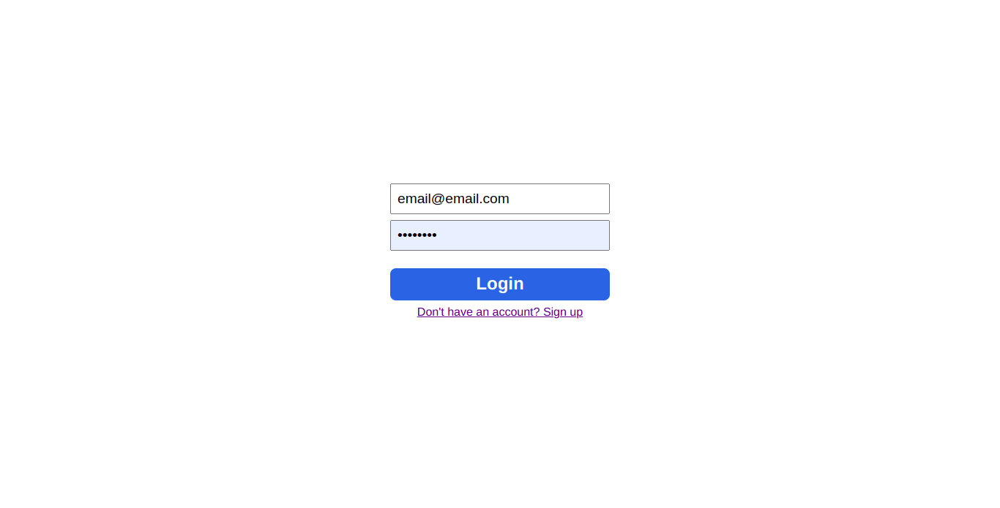

# Social Media

> Functional social media inspired by facebook. 


<br>

## Demo
---

[Live Demo](http://social-media-api.s3-website-us-east-1.amazonaws.com/)

<br>

## Screenshots

---

### Login page



<br>

### Home Page
<div style="display: flex; justify-content: space-between;">
    
    
</div>

<br>

## Features

---
- Authentication
- Posts
- Comments
- Likes
- Dark Mode

<br>

## Stack
---
- Sequelize
- Node
- React
- Express
- SQLite

<br>

## Installation

```bash
    git clone https://github.com/Gabrieltorreiro/social-media.git
    cd social-media/
    npm install
    
    # run server
    cd packages/server
    npm run dev

    # run client
    cd packages/client
    npm start
```